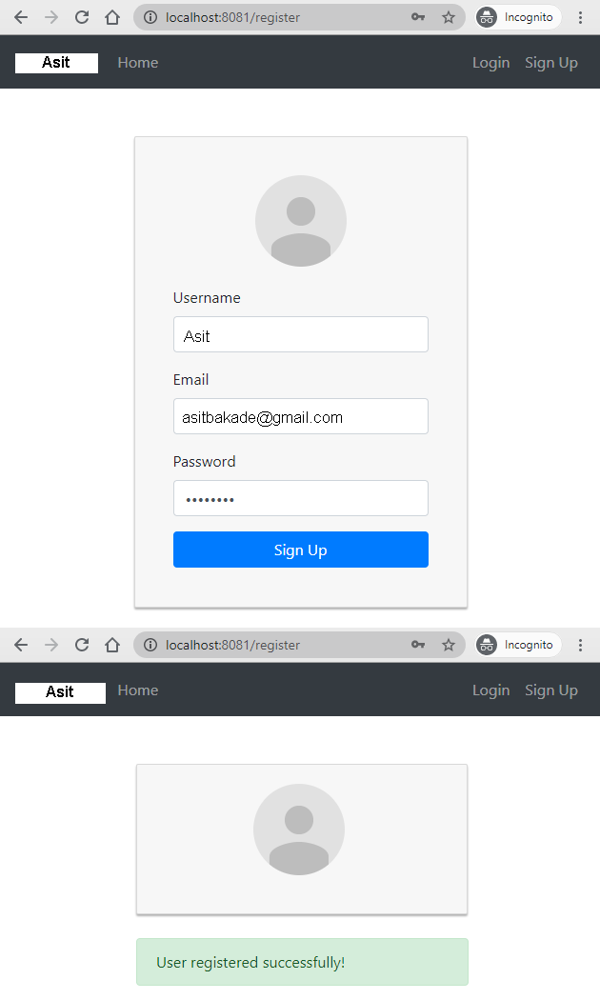
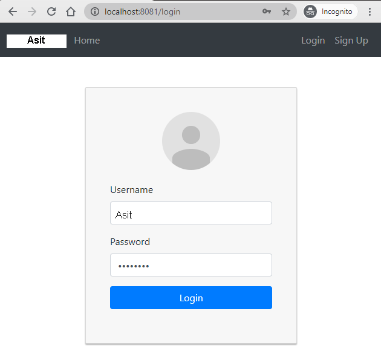
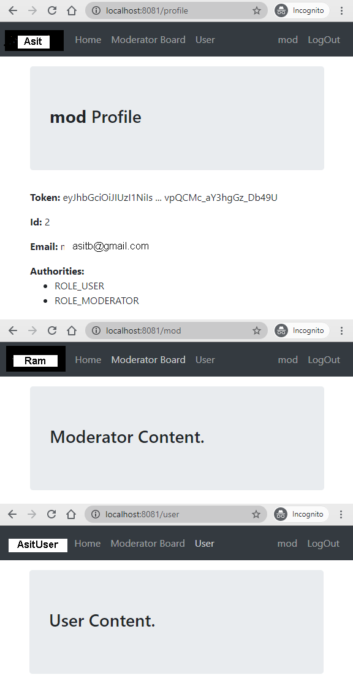

## React Redux Login example using Redux-toolkit & Hooks

- JWT Authentication Flow for User Login, Register, Logout
- Project Structure for React Redux JWT Authentication, Router, Axios
- Working with Redux Actions, Reducers, Store using redux-toolkit
- Creating React Function Components with Hooks & Form Validation
- React Function Components for accessing protected Resources (Authorization)
- Dynamic Navigation Bar in React App

For more detail, please visit:
> [React Redux Login & Registration example with Redux-toolkit & Hooks](https://www.bezkoder.com/react-redux-login-example-toolkit-hooks/)

Signup Page:



Login Page:



For Authorized account login (Moderator for example), the navigation bar will change:



Related Posts (without redux-toolkit):
> [React Redux Login, Logout, Registration example with Hooks](https://www.bezkoder.com/react-hooks-redux-login-registration-example/)

> [React Hooks: JWT Authentication & Authorization (without Redux) example](https://www.bezkoder.com/react-hooks-jwt-auth/)

> [React Redux Login, Logout, Registration example (using React Components)](https://www.bezkoder.com/react-redux-jwt-auth/)

Fullstack (JWT Authentication & Authorization example):
> [React + Spring Boot](https://www.bezkoder.com/spring-boot-react-jwt-auth/)

> [React + Node.js Express](https://www.bezkoder.com/react-express-authentication-jwt/)

This project was bootstrapped with [Create React App](https://github.com/facebook/create-react-app).

### Set port
.env
```
PORT=8081
```

### Note:
Open `src/services/auth-header.js` and modify `return` statement for appropriate back-end (found in the tutorial).

```js
export default function authHeader() {
  const user = JSON.parse(localStorage.getItem('user'));

  if (user && user.accessToken) {
    // return { Authorization: 'Bearer ' + user.accessToken }; // for Spring Boot back-end
    return { 'x-access-token': user.accessToken };             // for Node.js Express back-end
  } else {
    return {};
  }
}
```

### Project setup

In the project directory, you can run:

```
npm install
# or
yarn install
```

or

### Compiles and hot-reloads for development

```
npm start
# or
yarn start
```

Open [http://localhost:8081](http://localhost:8081) to view it in the browser.

The page will reload if you make edits.
